**------->** [English](/README_en_EN.md) | [Русский](/README.md) **<-------**

<p align="center">
  <picture>
    <source media="(prefers-color-scheme: dark)" srcset="./media/logo-dark.png">
    
  </picture>
</p>

---

<div align="center">

[](https://github.com/AnikBeris)
[](https://github.com/AnikBeris/n8n-docker/blob/main/LICENSE.md)
[](https://github.com/AnikBeris)

</div>

# Техническое руководство по установке N8N под VPN [3x-ui x-ray Vless] в Docker.


> **Отказ от ответственности:** Всё преведенные материалы расчитаны на личное использование.

**Если этот проект оказался полезным для Вас, вы можете оценить его, поставив звёздочку.**:star2:

<p align="left">
  <a href="https://pay.cloudtips.ru/p/7249ba98" target="_blank">
    
  </a>
</p>

Пожертвования горячо приветствуются, какими бы маленькими они ни были, и большое спасибо. 😌

| | |
|-------------:|:-------------|
| **Bitcoin (BTC)** |`1Dbwq9EP8YpF3SrLgag2EQwGASMSGLADbh`|
| **Ethereum (ERC20)** | `0x22258ea591966e830199d27dea7c542f31ed5dc5`|
| **Binance Smart Chain (BEP20)** | `0x22258ea591966e830199d27dea7c542f31ed5dc5`|
| **Solana (SOL)** | `yYYXsiVTzsvfvsMnBxfxSZEWTGytjAViE2ojf3hbLeF`|
| **Cloud tips** | [cloudtips](https://pay.cloudtips.ru/p/7249ba98) |
---


# 🚀 Установка n8n


Этот гайд поможет вам развернуть **n8n** на своём сервере, настроить иподготовить для работы.

---

### ✅ Функции / Features
- Установка `n8n` с PostgreSQL

- Интеграция с `VPN-прокси (VLESS + Reality)`

- Панель управления `VPN (3x-ui)`

- Веб-интерфейс контроля трафика `(yacd-meta)`

- Безопасная изоляция трафика с использованием `Docker`

- Поддержка вебхуков и `Telegram Bot`

---

### 🔗 Ссылки
- [3x-ui GitHub](https://github.com/AnikBeris/limitation-in-the-CPU-RAM-3X-UI/tree/main)

- [Clash Meta](https://github.com/MetaCubeX/mihomo)

- [n8n DockerHub](https://hub.docker.com/r/n8nio/n8n)

- [Документация n8n](https://docs.n8n.io/)

---

### 🧰 Используемые технологии

- [Docker](https://www.docker.com/)
- [Docker Compose](https://docs.docker.com/compose/)
- [clash meta](https://github.com/MetaCubeX/ClashX.Meta) — сервер x-ray
- [yacd-meta](https://github.com/MetaCubeX/Yacd-meta) — UI для контроля трафика

---

### 📂 Структура

```
.
├── docker-compose.yml
├── n8n_files/ # Сюда будет монтироваться рабочая директория
├── project_photos/ # папка для хронения изображений
├── project_files/ # папка для хронения файлов
├── project_db/ # папка для хронения баз данных
└── config/ 
    └──config.yaml # конфигурационный фаил сервера clash-meta

```

### 🔧 Предварительные требования

- [Docker](https://docs.docker.com/get-docker/)
- [Docker Compose](https://docs.docker.com/compose/install/)
- [x-ray // 3x-ui](https://github.com/AnikBeris/self-signed-certificate)

---

# 📦 Установка 3x-ui

<details>
    <summary>⚠️ Установка 3x-ui: </summary>
 
   # Установка 3X UI на Debian/Ubuntu
### 1. Перед установкой
Прежде чем начинать установку, убедитесь, что ваша система обновлена. Выполните следующие команды:
```bash
apt-get update && apt-get upgrade -y
```

### 2. Установка необходимых пакетов
Убедитесь, что на вашем сервере установлены необходимые пакеты:

```bash
apt-get install wget curl -y
```

### 3. Установка панели 3X-UI
Для установки панели на сервер запустите выполнение скрипта командой:

```bash
bash <(curl -Ls https://raw.githubusercontent.com/mhsanaei/3x-ui/master/install.sh)
```

Во время установки скрипт задаст вопрос:

```info
Would you like to customize the Panel Port settings? (If not, a random port will be applied) [y/n]:
```
Отвечаем `"y"` если хотите установить порт сами, или "n" тогда скрипт установит порт самостоятельно
Не устанавливайте стандартные `порты 22, 80, 8080`. Рекомендуем выбрать любой другой, например `8181`
После выполнения этих шагов установка панели будет завершена скрипт сообщит Вам данные для подключения такого вида:

`пример`
```
Username: 3favnjd8

Password: Msdf823Ll

Port: 40608

WebBasePath: vpkPI6ex9ajesDX

Access URL: http://192.168.0.149:40608/vpkPI6ex9ajesDX

```

После выполнения этих шагов установка панели будет завершена и можно подключиться через браузер к панели по пути

```
http://IP_адрес_вашего_сервера:порт/WebBasePath(пример: http://192.168.0.10:40608/vpkPI6ex9ajesDX)

```

После ввода адреса в браузере Вы попадете на окно входа в панель, куда необходимо ввести логин и пароль пользователя, которые ранее сообщил скрипт.

  <picture>
    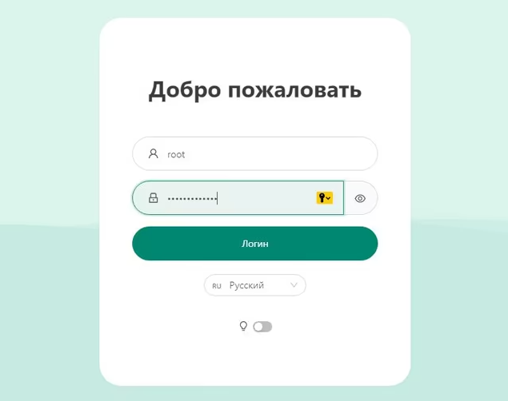
  </picture>
</details>

### Теперь можно переходить к настройке первого подключения.
- Переходим в боковом меню "Подключения" -> Нажимаем кнопку "Добавить подключение"

  <picture>
    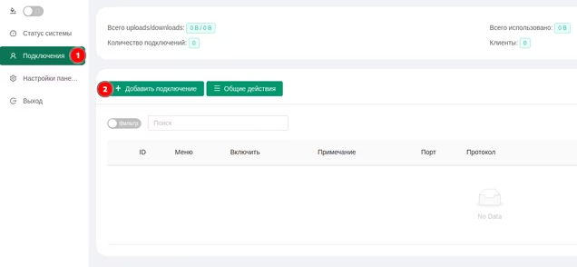
  </picture>
</details>

### Сначала настроим протоколы

  <picture>
    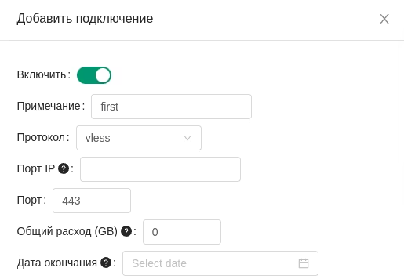
  </picture>
</details>

- Примечание - название подключения
- Протокол - vless
- Порт IP - оставляем пустым, панель автоматически заполнит это поле
- Порт - 443, т.к. мы хотим маскироваться под реальный https трафик

###  Далее проматываем вниз и включаем `Reality`, появится дополнительные поля

  <picture>
    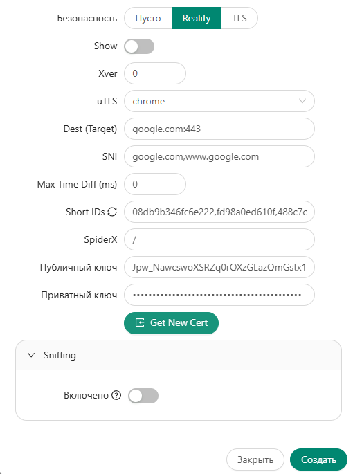
  </picture>
</details>

- uTLS - я выбираю chrome, т.к. это основной мой браузер, но большая часть рекомендаций сходятся на том что нужно указывать firefox
- Домен - панель заполнит автоматически
- Dest и Server Names - рекомендуется указывать сайт за пределами РФ, не заблокированный РКН, без редиректов, очень хорошо если сайт имеет айпишник принадлежащий тому же хостеру где работает прокси. Подойдут сайты крупных технологических компаний, Microsoft, Samsung, Asus и т.д.
- Private Key и Public Key - генерируем нажатием кнопки Get New Key

### Теперь настраиваем первого клиента

  <picture>
    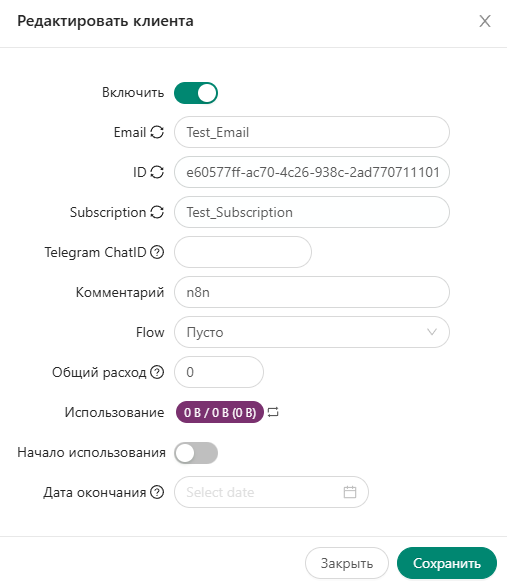
  </picture>
</details>

- Email - здесь не обязательно должен быть email, указываем что-нибудь что поможет в будущем идентифицировать клиента и протокол
- Subscription - Поле оставляем пустым
- Flow - надо оставить пустым не выбирать `"xtls-rprx-vision"`, данное поле появится только после того, как `Reality` будет включен.
Жмём создать и видим в списке подключенией что-то подобное:

  <picture>
    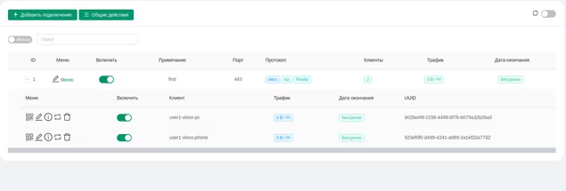
  </picture>
</details>

### открываем конфиг для заполнения

  <picture>
    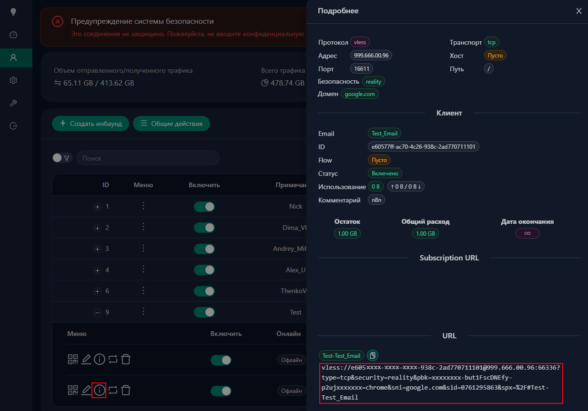
  </picture>
</details>
---

# 📦 Установка

### Шаг 1: 📌 Создание `.env` и `config.yaml` файла. Подготовка к установке
---

- Создаём новую директорию для **n8n** и переходим в неё:

```bash
mkdir -p ~/n8n/{n8n_data,n8n_db,n8n_files,n8n_node_modules,project_db,project_files,project_photos,config} && cd ~/n8n
```

## Создай `.env` файл где будем хранить выжная информация

```bash
touch .env && nano .env
```
- Заполняем фаил `.env`:

```bash
# настройки PostgreSQL логин и пароль замените на свой

DB_POSTGRESDB_DATABASE=n8n
DB_POSTGRESDB_USER=n8nuser
DB_POSTGRESDB_PASSWORD=n8npass

# настройки для подключения
DB_TYPE=postgresdb
DB_POSTGRESDB_HOST=n8n-db
DB_POSTGRESDB_PORT=5432


# Основные настройки n8n
N8N_HOST=your.domain.com
WEBHOOK_URL=https://your.domain.com
N8N_PORT=5678
N8N_PROTOCOL=https
NODE_ENV=production
N8N_ENCRYPTION_KEY=djwJNK/YUrhLagYsM72cYpu/JdR82a9BjlS3kAVA6ntBuQhAaYL6LhzE0Qan0jLE
GENERIC_TIMEZONE=Europe/Moscow
N8N_ENFORCE_SETTINGS_FILE_PERMISSIONS=true
N8N_SECURE_COOKIE=false  # true если хотите подключение только по доменному имени / если включить потеряется возможность подключения по IP, останется только по доменному имени.
```
- После вставки нажми `Ctrl+D`, чтобы завершить ввод. 🚀


<details>
    <summary>⚠️ Важно: </summary>
 
- **N8N_ENCRYPTION_KEY=** <---- ключ можно сгенерировать на сайте установив количество симвалов `48`[base64](https://generate.plus/en/base64). Если ключ будет не верен или поле будет пустым, то при востановлении файло или перезагрузку, все файлы будут утерены.
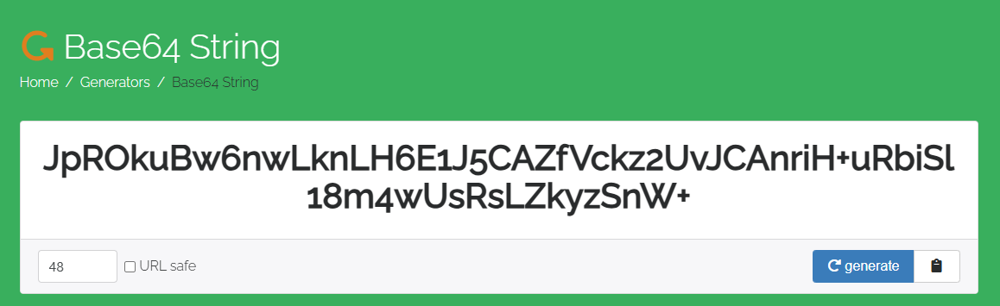

- **GENERIC_TIMEZONE=** <---- Выставляем внутренее время
- **N8N_HOST=** <---- Доменное имя для входа в **n8n**
- **WEBHOOK_URL=** <---- Доменное имя для работы **WEBHOOK** внутри **n8n**

</details>

```bash
cd config
```

```bash
touch config.yaml && nano config.yaml
```
- Заполняем фаил `config.yaml`:

```yaml
mixed-port: 7890
allow-lan: true
mode: rule
log-level: debug  # временно для диагностики
external-controller: 0.0.0.0:9090
dns:
  enable: true
  enhanced-mode: fake-ip
  nameserver:
    - 8.8.8.8
    - 1.1.1.1

proxies:
  - name: "VPN-tun"
    type: vless
    server: 999.666.00.12 # заменяем на "Адрес" из конфига
    port: 47712 # заменяем на "порт" из конфига
    uuid: 2dxxxxe4-0xxx-4d30-969c-e27exxxxx448 # заменяем на "ID" из конфига
    network: tcp
    tls: true
    udp: true
    security: reality
    reality-opts:
      public-key: "Iqxxxxxxxx9GkU-but1xxxxxDNEfy-p2ujq_SxxxxnY" # заменяем на "pbk" из конфига url
      ### выглядет он вот так 
      ### vless://2dxxxxe4-0xxx-4d30-969c-e27exxxxx448@999.666.00.12:47712?type=tcp&security=reality&pbk=Iqxxxxxxxx9GkU-but1xxxxxDNEfy-p2ujq_SxxxxnY&fp=chrome&sni=google.com&sid=0761xxxx63&spx=%2F#Test-Test
      short-id: "0761xxxx63" # заменяем на "sid" из конфига
      spider-x: "/"
    servername: "google.com"
    client-fingerprint: "chrome"
    flow: ""  # для vless без xtls

proxy-groups:
  - name: "Proxy"
    type: select
    proxies:
      - "VPN-tun"
      - "DIRECT"

rules:
  # seatable
  - DOMAIN-SUFFIX,seatable.io,DIRECT
  # github
  - DOMAIN-SUFFIX,github.com,DIRECT
  - DOMAIN-SUFFIX,githubusercontent.com,DIRECT
  - DOMAIN-SUFFIX,githubassets.com,DIRECT
# - DOMAIN-SUFFIX,<заменити на ваш сайт который должен работать без VPN>,DIRECT
# - DOMAIN-SUFFIX,<заменити на ваш сайт который должен работать исключительно по VPN>,Proxy


  - GEOIP,LAN,DIRECT
  - GEOIP,Fast-RU,DIRECT
  - GEOIP,RU,DIRECT

  - MATCH,Proxy # Proxy - это весь не указанный трафик в rules будет идти через vpn. если нужно, что бы трафик шёл без vpn заменити на DIRECT
```

- После вставки нажми `Ctrl+D`, чтобы завершить ввод. 🚀
---

### Шаг 2: 📌 Создание docker-compose.yml и установка n8n + VPN

### Создаём файлик `docker-compose.yml`

```bash
touch docker-compose.yml && nano docker-compose.yml
```
### Заполняем установочный фаил `docker-compose.yml`:

```yaml
version: '3.8'

networks:
  n8n_network:
    name: n8n_network
    driver: bridge

services:

#################### VPN
  clash-meta:
    image: metacubex/clash-meta:latest
    container_name: n8n-clash-meta
    restart: unless-stopped
    ports:
      - "6092:7890"   # Прокси порт (SOCKS5 / HTTP)
      - "6090:9090"   # API порт
    volumes:
      - ./config:/root/.config/clash
    depends_on:
      - yacd-meta

    networks:
      - n8n_network

  yacd-meta:
    image: asnil/yacd-meta:latest
    container_name: n8n-clash-ui
    restart: unless-stopped
    ports:
      - "6093:80"  # Web UI порт

    networks:
      - n8n_network

#################### N&N
  db:
    image: postgres:17
    container_name: n8n-DB
    hostname: n8n-db
    security_opt:
      - no-new-privileges:true
    healthcheck:
      test: ["CMD", "pg_isready", "-q", "-d", "${DB_POSTGRESDB_DATABASE}", "-U", "${DB_POSTGRESDB_USER}"]
      timeout: 45s
      interval: 10s
      retries: 10
    volumes:
      - ./n8n_db:/var/lib/postgresql/data:rw
    environment:
      TZ: ${GENERIC_TIMEZONE}
      POSTGRES_DB: ${DB_POSTGRESDB_DATABASE}
      POSTGRES_USER: ${DB_POSTGRESDB_USER}
      POSTGRES_PASSWORD: ${DB_POSTGRESDB_PASSWORD}
    restart: on-failure:5
    networks:
      - n8n_network

  n8n:
    image: n8nio/n8n:latest # :latest последняя версия // :stable стабильная версия // :beta версия в разработке
    container_name: n8n
    healthcheck:
      test: ["CMD-SHELL", "nc -z 127.0.0.1 5678 || exit 1"]
      interval: 10s
      timeout: 5s
      retries: 3
      start_period: 90s
    hostname: n8n
    user: 0:0 # нужно для устранения проблем внутри контейнера
    security_opt:
      - no-new-privileges:true
    ports:
      - 6789:5678 # порты можно переназначать слева порт сервера через него выходим в сеть, справа порт контейнера. Меняем только порт сервера до двоиточия --> 6789:5678 <--этот не трогаем (пример: - 1231:5678)
    volumes:
      - ./n8n_node_modules:/user/local/lib/node_modules:rw
      - ./n8n_data:/home/node/.n8n:rw
      # рабочии папки Слева то что лежит на сервере, справа то что будет размещено в контейнере
      - ./n8n_files:/files:rw
      - ./project_photos:/data/photos:rw
      - ./project_files:/data/files:rw
      - ./project_db:/data/db:rw
    environment:
      N8N_HOST: ${N8N_HOST}
      WEBHOOK_URL: ${WEBHOOK_URL}
      N8N_PORT: ${N8N_PORT}
      N8N_PROTOCOL: ${N8N_PROTOCOL}
      NODE_ENV: ${NODE_ENV}
      N8N_ENCRYPTION_KEY: ${N8N_ENCRYPTION_KEY}
      GENERIC_TIMEZONE: ${GENERIC_TIMEZONE}
      N8N_ENFORCE_SETTINGS_FILE_PERMISSIONS: ${N8N_ENFORCE_SETTINGS_FILE_PERMISSIONS}
      N8N_SECURE_COOKIE: ${N8N_SECURE_COOKIE}
      TZ: ${GENERIC_TIMEZONE}
      DB_TYPE: ${DB_TYPE}
      DB_POSTGRESDB_DATABASE: ${DB_POSTGRESDB_DATABASE}
      DB_POSTGRESDB_HOST: ${DB_POSTGRESDB_HOST}
      DB_POSTGRESDB_PORT: ${DB_POSTGRESDB_PORT}
      DB_POSTGRESDB_USER: ${DB_POSTGRESDB_USER}
      DB_POSTGRESDB_PASSWORD: ${DB_POSTGRESDB_PASSWORD}
    restart: on-failure:5
    depends_on:
      db:
        condition: service_healthy
    networks:
      - n8n_network


```
- После вставки нажми `Ctrl+D`, чтобы завершить ввод. 🚀

<details>
    <summary> ⚠️ Важно:  </summary>

**n8n** и **база postgres** должны находиться в одной локальной сети.
```yaml
    networks:
      - shared_network

networks:
  shared_network:
    name: shared_network
    driver: bridge
```
</details>

### Шаг 3: 📌 запустим **n8n** командой:

```sh
docker-compose up -d
```

### **yacd-meta** доступна по адресу: `http://<адрес_сервера_на_котором_запущен_yacd-meta>:6093`

- пример -> `http://192.168.1.40:6093`

### откроется страница с выбором сервера `clash-meta`
вводим адрес локальной машины и нажимаем `add`
пример -> `http://192.168.1.40:6093`

  <picture>
    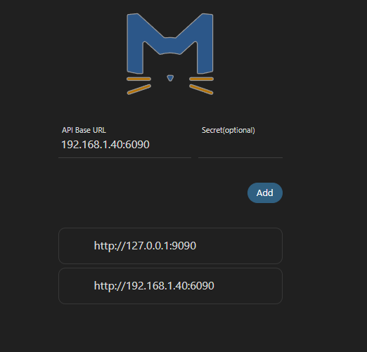
  </picture>
</details>

### после чего выбираем наш сервер

  <picture>
    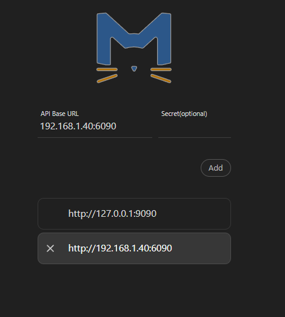
  </picture>
</details>

### открывается главная сраница. выбираем пункт меню `Config`

- в пункте `Log Level` выбираем `Debug`
- в пункте `Latency Test URL` забиваем адрес до котого будет идти проверка пинга

  <picture>
    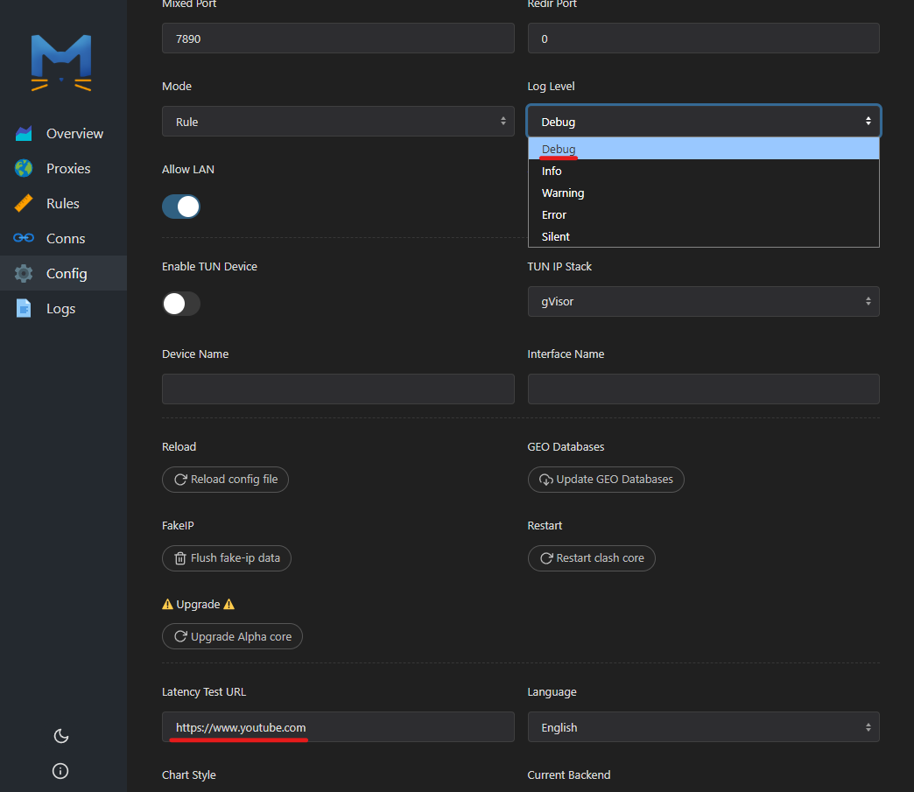
  </picture>
</details>


### открывается главная сраница. выбираем пункт меню `Proxies`

- выбираем наше подключение

  <picture>
    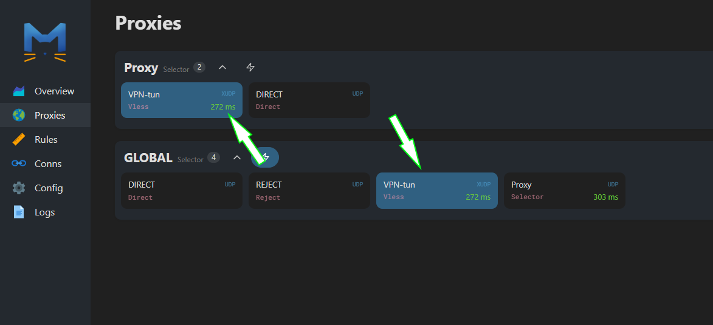
  </picture>
</details>

- Нажимаем на молнию 

  <picture>
    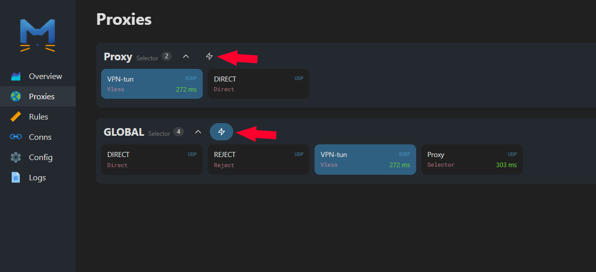
  </picture>
</details>

- если всё сделано правильно то увидим пинг до сервера

  <picture>
    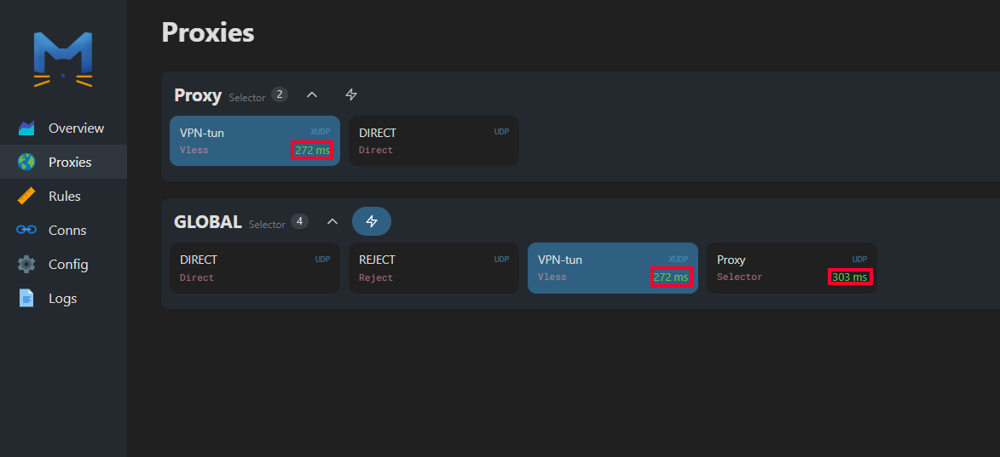
  </picture>
</details>

### открывается главная сраница. выбираем пункт меню `Logs`
дальше открываем
### **n8n** доступна по адресу: `http://<адрес_сервера_на_котором_запущен_n8n>:6789`

- пример -> `http://192.168.1.40:6789`

- пример обратный прокси-> `n8n.anikberis.com`

зайдя на страницу `N8N` запускаем `Workflow` и наблюдаем наши соеденения

  <picture>
    
  </picture>
</details>


---

⚠️ Важно: Для того, что бы Telegram Bot пересылал сообщение из чата. Сервер должен быть установлен на порту 80 или 443.

⚠️ Важно: На текущий момент отправка обновлений через вебхуки Telegram доступна только на эти порты: 443, 80, 88, 8443
⚠️ Важно: Больше информации про Telegram Bot можно найти тут ---> [Справочник по Bot API](https://tlgrm.ru/docs/bots/api)
---

## Лицензия
Этот проект распространяется по [MIT License](https://github.com/your-repo/blob/main/LICENSE).


## Лицензия
Этот проект распространяется по [MIT License](https://github.com/your-repo/blob/main/LICENSE).

---

Для детальной документации ознакомьтесь с [Английским README](/README.md) или [Русским README](/README.ru_RU.md).
